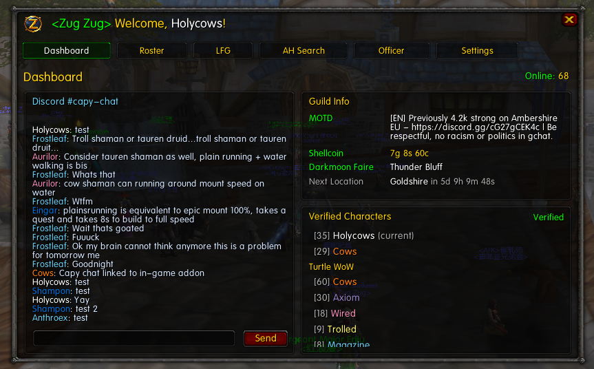
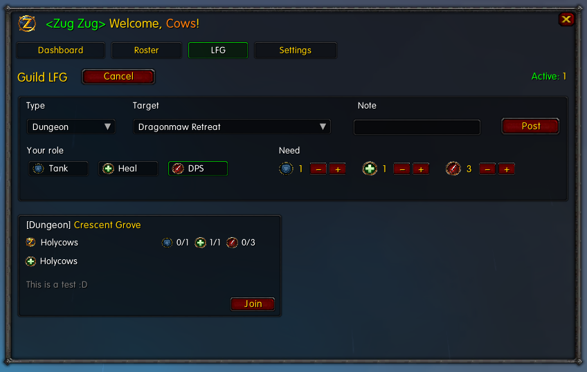
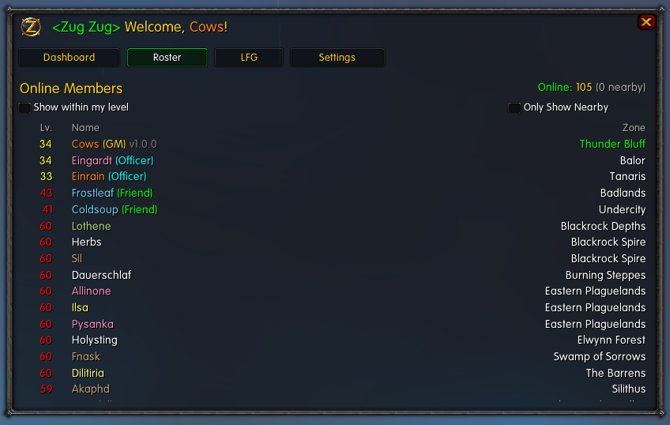
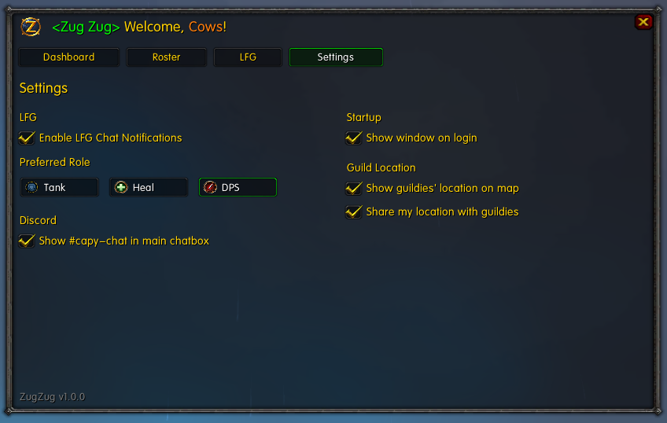

# Zug Zug

This is a guild addon for our members of our guild on **1.12.1** clients.

It brings a few guild tools into one simple in-game window: a dashboard, real-time Discord #capy-chat, guild LFG, online roster, verified character info, and a few settings to make the addon feel right for you.

Open it in game with: 

`/zug` or `/zz`

## Dashboard
A quick overview of guild info, #capy-chat from Discord, and Shellcoin / Darkmoon Faire information.

## Discord #capy-chat

The dashboard includes **Discord #capy-chat**, so guild members can read and send #capy-chat messages from inside the game.

You do not need to be Discord verified just to chat from the addon, but verifying gives you extra dashboard features.

## Guild LFG

The LFG tab helps guildies make and join groups without spamming guild chat.

You can:

- Post a group for dungeons, raids, quests, or custom activities
- Pick your preferred role
- Join as Tank, Healer, or DPS
- Get optional chat notifications when new guild LFGs are posted

## Online Roster

The roster tab shows who is online, with class-colored names and location info.

It is useful for quickly seeing who is around, where guildies are, and who might be nearby.

## Verified Characters

If you verify through Discord, the Zug Zug addon can show your linked characters on the dashboard.

To verify, run this command in Discord:

`/capy verify`

Verification is not required to use the whole addon, but it unlocks extra identity/character features.

## Location Sharing 

You can choose to share your location with guildies, and see other guildies' locations on your map.

They will appear as squares colored to their class, only available when viewing the location they are in.

They do not show up on your minimap.

## Settings

The Settings tab lets you adjust a few personal preferences.

You can set:

- Your preferred LFG role
- Whether LFG notifications are enabled
- Whether the Zug Zug addon window opens on login
- Guild location display options

## Notes

This addon works best when other guild members are using it. We are still working on this addon, so if you have any feature requests, run into any bugs, or have any questions, feel free to reach out on Discord!
